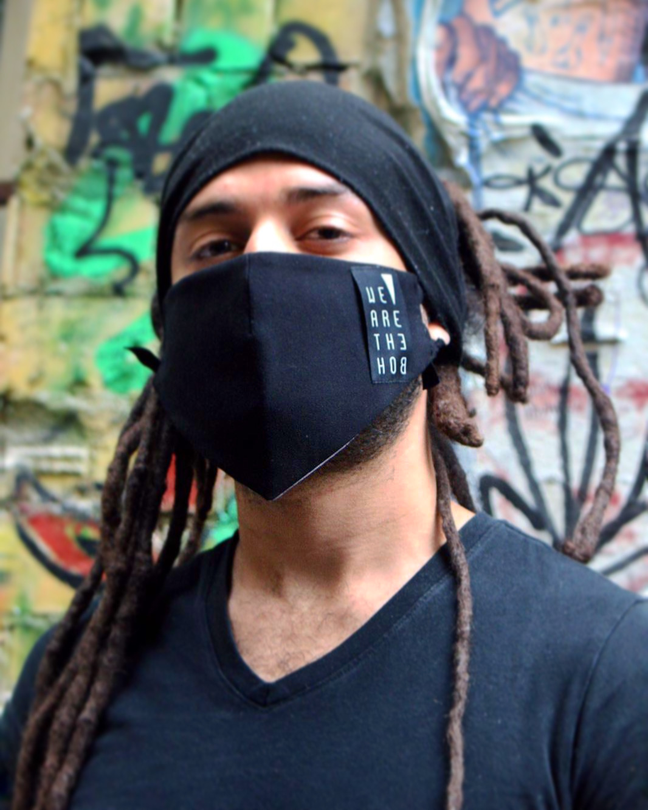

# Hi! I'm Gabriel Falcão

--------------------------------

## Who am I

I am a human-being seeking a life of human-flourishing. Fallible, but self-determined to get up and learn from life's setbacks.
A coder/decoder of reason and meaning made of flesh. I care about the well-being of others and have a hard time taking care of myself.

Writing code is and has been my primary means of self-expression and I
prefer to act constructively rather than destructively.  I wish to
live in a world where we are all kind to each other and respect our
differences. But I also recognize the pervasiveness of paradoxes and
the phractal misunderstanding that the very concept of understanding a
concept is precluded by one's ability to realize that a non-conceptual
understanding of reality is not the end of the road but rather the
road itself.

I believe that pursuing knowledge and galvanizing my intuitions with
layers upon layers of understanding is something worth doing. That
ignorance can be bliss, but leads us to become mere zombies following
blind instructions and that is a dangerous thing to do because it
dissolves our consciousness and kindness.

We are all struggling to live, eat, thrive, prevent sickness and
attain health and dignity. Why make the world worse by acting
absolutely poorly with others?

There is at least one paradox there, but let me take this digression as an excuse to continue at a later time.

## What I do

Well, lately I've been trying to live while being bombarded by chaos and
acts of ignorance, thrived thanks to acts of kindness and genuine
compassion, at times even by nameless strangers whose empathy can be
felt even from a distance (relative or absolute).

I have spent the last 20 years or so writing FOSS(Free Open-Source
Software) that primarily solved my own problems and then fearlessly
publishing their source on Github and other routes of distribution.

There are tools, libraries and frameworks I have developed used
pervasively by individuals, businesses, institutions and
governments. And I have never charged for anything, primarily because
I rather spend time producing meaningful code and ultimately because,
in the past I did not care to profit in monetarily terms.

My tools focus on the topics that I am most reasonably passionate
about, for instance:

* Automated Testing and Code Quality - because I care about delivering code with confidence and make [sure](https://github.com/gabrielfalcao/sure) that everything I make is as robust as possible. To that end, I have spend an inordinate amount of time making sure that bugs and problems are reproducible, testable and fixable.
* Cryptography and information transcoding - because the puzzles involved feed my mind with an endless stream of challenges give me a feeling of intellectual reward, and because I am a cypherpunk of sorts. I created my first custom character mapping at age 9 to exchange messages with a best friend in school. In fact we had our own charmaps which we merely called alphabets at the time. We shared our alphabets with one another so that we could write messages that no one would understand. As nine-year-olds we obviously didn't have any big secrets, but encoding/decoding information was more fun than playing stupid games. Now that I think about it, we used coding to tell each other how the other boys were aggressive and dumb for wasting their time bullying us for being intelligent.
* Implementation of Protocols - because protocols are fascinating. I wrote my first TCP client/server in VisualBasic 6 when I was probably 13 or 14 years old. I wanted the client to tell the server to execute an arbitrary program at their side, so before knowing what a protocol was I built one out of intuition, it was simple something like `program:<EXECUTABLE>` where `<EXECUTABLE>` was the path to any `.exe` file. I had to build *parser* and did not even know that word. The program worked, and later when I learned the words `protocol` and `parsing` I felt an immense awe. The kind of awe one discovers when there is a word to describe a concept one's spent too much time trying to articulate in too many words. (something I still seem to do, as you can probably notice).
* Text Manipulation: encoding/decoding, transcription and compression
* File-System tools: compression/decompression, path normalization, backup and information extraction.
* HTTP Frameworks: I have implemented HTTP in so many levels, first I built frameworks just for the sake of learning the protocol's internals by heart. Eventually I wanted to solve the problem of testing external API's without internet access and implemented a fake `socket` module for python, so my mind heared [HTTPretty](https://github.com/gabrielfalcao/HTTpretty).
* API Clients - from API-specific to Generic RESTful clients

## How I do

My main editor is EMACS. Emacs is effectively an extension of my body
because its learning curve was so steep that demanded hours upon hours
of not giving up but now I can code incredibly fast.

I do not use Github Copilot frankly because using VS Code or any other
editor feels awkward.

Also at this point I have 183 public open-source repositories on
Github and I would feel cheated to see Copilot generating code that it
learned from my hard work.

## Main Projects

### General Projects

- [Makefile-python-basic](https://github.com/gabrielfalcao/Makefile-python-basic) - Makefile-based Python project maintenance
- [go-horse](https://github.com/gabrielfalcao/go-horse) - A stupidly simple HTTP server implemented in C, using Macros as a DSL. Also it has a memory leak I never cared to solve because all I wanted to accomplish was test the libmicrohttpd and play around with macros of the GCC preprocessor I happened to be using at that time.

### 🐍 Python Projects

- [sure](https://github.com/gabrielfalcao/sure) - Assertion Library for Python, inspired by Ruby's R-Spec
- [HTTPretty](https://github.com/gabrielfalcao/HTTpretty) - Hijacks Python's `socket` module primarily to intercept HTTP requests but one can probably use its features to accomplish so much more because all the heavy lifting of reimplementing the socket methods is already done by HTTPretty's `FakeSocket`
- [uiclasses](https://github.com/gabrielfalcao/uiclasses) - A library for modeling data in memory primarily for of presenting sets of models to the user-interface dujour (pseudo-TTY). This library was designed not for performance but to be human-friendly instead. Viewer discretion advised :)
- [xmpp](https://github.com/gabrielfalcao/xmpp) - XMPP protocol implemented in pure python. It opens a XML `<stream>`, transacts with the other side of the TCP connection then reads/writes stanzas. It is agnostic in reference to whether to act as a client or server. It's a relatively plain implementation of the protocol and can be used with any concurrency paradigms.
- [berlin-bike-watch](https://github.com/gabrielfalcao/berlin-bike-watch) - I spent so much money in a bike that I dreamed to have since I was a teenager, shipped it from NYC to Berlin, only to have it stolen with a cryptonite lock cut, which I didn't even know was possible BTW. I searched the Berlin Police website to see if anyone had found it and wrote this tool to automate the search, but rather than remaining frustrated I chose to share the code I wrote with the world, hoping it could help someone else.

### 🦀 Rust Projects

- [marseille](https://github.com/gabrielfalcao/marseille) - A small ANSI to morse-code encoder, wrote this as deliberate practice to remember morse code which I inherently love simply because of the pervasiveness of its applications and help me understand the world around me. For instance, listening to music was never the same, neither was making music, after learning morse.
- [mac-disk-monitor](https://github.com/gabrielfalcao/mac-disk-monitor) - A rust crate that launches a thread which in turn forks a subprocess watching for changes in the file-system and notifies the main thread via channel. I wrote this mostly to practice rust.

### ☕️ ECMAScript (et cetera) Projects

- [emerald](https://www.npmjs.com/package/emerald) (*in memoriam*) A CI server I wrote in NodeJS before node was even acquired by Microsoft, I think. My idea was to take advantace of Node's cooperative multitasking to have one single POSIX process containing actors to run build jobs, serving HTTP pages and webhooks, and communicating with a datastore.

### ♟️ Go Projects

- [gspec](https://github.com/gabrielfalcao/gspec) (*old experiment*) - When I first taught myself Go I was not happy with the lack of colored visual cues and cluttered presentation of failed test results, so I wrote `gspec` a test runner but for reasons I can't remember I didn't continue its development. But since I put relative effort in the application of AST parsing and introspection I decided to share the code, I guess.

--------------

### **O**ther **S**tats

###### Python Package Downloads

- steadymark - 
- HTTpretty - 
- agentzero - 
- agile - 
- bolacha - 
- carbontube - 
- carpentry - 
- chemist - 
- coalminer - 
- couleur - 
- dead - 
- dominic - 
- floresta - 
- gitgraph - 
- grammarian - 
- httpretty - 
- jaci - 
- jobminer - 
- keybone - 
- lettuce - 
- lineup - 
- markment - 
- mercator - 
- milieu - 
- minions - 
- plant - 
- plural - 
- privacy - 
- repocket - 
- shrine - 
- speakers - 
- sphinx - 
- star-maker - 
- sure - 
- truck - 
- tumbler - 
- uiclasses - 
- unclebob - 
- vargas - 
<!--  -->
<!--  -->
<!--  -->
<!--  -->

<!-- ###### Docker Image Pulls -->

<!--  -->
<!--  -->
<!--  -->
<!--  -->
<!--  -->
<!--  -->
<!--  -->
<!--  -->
<!--  -->
<!--  -->
<!--  -->
<!--  -->
<!--  -->
<!--  -->
<!--  -->
<!--  -->
<!--  -->
